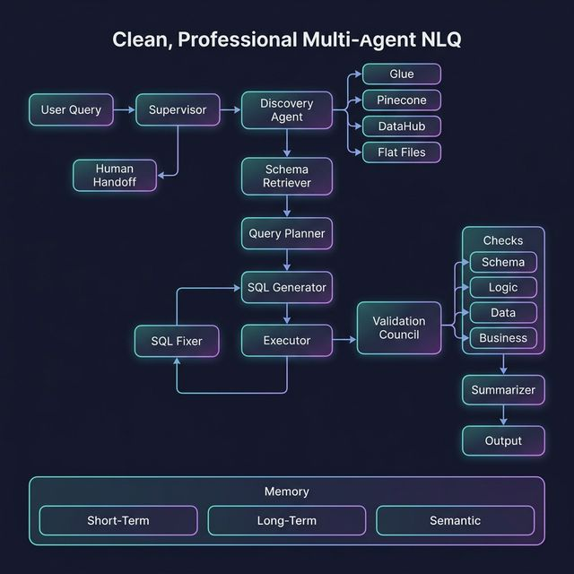

# 🏗️ G-Eagle NLQ Agent — Design Document

## 1. System Overview

G-Eagle is a **multi-agent NLQ (Natural Language Query) system** that transforms natural language business questions into validated SQL queries, executes them against data warehouses, and returns human-readable insights.

The system is built on **LangGraph** — a stateful, graph-based orchestration framework — allowing each processing step to be an independent agent node with clear inputs, outputs, and conditional routing.

### Core Design Principles

| Principle | How It's Applied |
|-----------|-----------------|
| **Modularity** | Each agent is a standalone function with a defined interface |
| **Resilience** | Self-healing retry loops, graceful connector degradation |
| **Transparency** | Full state tracing through every node, error logs, SQL history |
| **Extensibility** | Factory patterns for LLM, DB, and discovery — add new backends without touching core logic |
| **Governance** | 4-layer validation council, metrics approval workflow, human handoff |

---

## 2. Architecture



### 2.1 Agent Flow

```
User Query (NL)
      ↓
 Supervisor Agent  ←──────────────────────────────┐
      ↓                                            │
 Discovery Agent (DataHub + Glue + Pinecone + FF)  │
      ↓                                            │
 Schema Retriever                                  │
      ↓                                            │
 Query Planner                                     │
      ↓                                            │
 SQL Generator ──→ Executor ──→ [Error?] ──→ SQL Fixer (x N retries)
                      ↓
              Validation Council
              (Schema / Logic / Data / Business)
                      ↓
                 Summarizer
                      ↓
              Final Council Check
                      ↓
                  Output / Human Fallback
                      ↓
              Memory + KB Feedback Loop
```

### 2.2 State Schema

Every agent reads from and writes to a shared `AgentState` TypedDict:

```python
class AgentState(TypedDict):
    user_query: str                    # Original NL question
    session_id: str                    # Session tracking
    discovered_tables: List[dict]      # From discovery
    selected_tables: List[str]         # After council ranking
    schema: dict                       # {table: [columns]}
    query_plan: dict                   # Structured analytical plan
    sql: str                           # Current SQL
    sql_history: List[str]             # All SQL versions
    execution_result: Optional[Any]    # Query result
    execution_error: Optional[str]     # Error if failed
    retry_count: int                   # Retry tracker
    validation_result: dict            # Council output
    summary: str                       # Business summary
    confidence_score: float            # 0.0 - 1.0
    needs_human: bool                  # Escalation flag
    final_answer: Optional[str]        # Rendered output
    memory_context: dict               # Retrieved memory
    error_log: List[str]               # Trace log
```

---

## 3. Discovery System

### 3.1 Multi-Source Architecture

The discovery system searches **4 independent metadata sources** in parallel:

```
                    ┌─ Glue Catalog ─── boto3 search_tables
                    │
User Query ─────────┼─ Pinecone ─────── vector similarity (embeddings)
                    │
                    ├─ DataHub ──────── GraphQL API
                    │
                    └─ Flat Files ───── keyword match on JSON catalog
```

All connectors return a **normalized schema**:
```json
{
  "source": "glue|pinecone|datahub|flatfile",
  "name": "table_name",
  "database": "db_name",
  "columns": [{"name": "col", "type": "varchar"}],
  "description": "...",
  "score": 0.95
}
```

### 3.2 Discovery Council

An **LLM-based mini-council** that:

1. **Deduplicates** tables appearing in multiple sources
2. **Scores** each table for relevance (0.0 – 1.0)
3. **Selects top-K** (configurable, default 5)
4. **Explains** why each was chosen

Fallback: if LLM parsing fails, candidates are sorted by existing score.

---

## 4. Query Intelligence

### 4.1 Query Planner

Converts NL → structured plan **without writing SQL**:

```json
{
  "intent": "aggregation",
  "metrics": ["revenue"],
  "dimensions": ["region"],
  "filters": [{"column": "order_date", "operator": "between", "value": ["2024-03-01", "2024-03-31"]}],
  "time_granularity": "monthly",
  "aggregation": "sum",
  "sorting": {"column": "revenue", "order": "desc"},
  "limit": 10
}
```

This separation ensures the LLM thinks in **business terms** first, reducing hallucinated SQL.

### 4.2 SQL Generator

Takes the structured plan + schema + inferred join map → SQL string.

Key features:
- **Dialect-aware**: Generates Presto/Athena, Snowflake, PostgreSQL, or BigQuery SQL
- **Auto-inferred joins**: Detects shared column names across tables
- **CTE preference**: Uses CTEs over subqueries for readability

---

## 5. Self-Healing Execution

### 5.1 Error Classification

When SQL execution fails, the error is first **classified** by an LLM:

| Category | Example |
|----------|---------|
| `SYNTAX_ERROR` | Invalid SQL syntax |
| `MISSING_COLUMN` | Column doesn't exist |
| `MISSING_TABLE` | Table doesn't exist |
| `JOIN_ERROR` | Cartesian product |
| `EMPTY_RESULT` | 0 rows returned |
| `TIMEOUT` | Query too slow |
| `PERMISSION_ERROR` | Access denied |

### 5.2 Retry Loop

```
Executor → Error? ─── Yes ─→ classify error → fix SQL → re-execute
                 │                                   ↑
                 │           (retry_count < max) ────┘
                 │
                 ├── No ──→ Validation Council
                 │
                 └── Exhausted ──→ Human Handoff
```

Configurable via `retry.max_attempts` (default: 3).

---

## 6. Validation Council

Four independent validators run on every successful query:

| Validator | Type | Weight | What It Checks |
|-----------|------|--------|----------------|
| **Schema** | Rule-based | 15% | Column references exist in schema |
| **Logic** | LLM-based | 30% | Correct joins, filters, aggregations |
| **Data Sanity** | Rule-based | 25% | NULL rates, outliers, negative values |
| **Business** | LLM-based | 30% | Matches metric definitions |

### Confidence Score

```
confidence = 1.0 - Σ(weight × failed_check)
```

### Routing Decision

| Confidence | Validation | Action |
|------------|------------|--------|
| > 0.7 | All passed | → Summarizer |
| 0.4 – 0.7 | Issues found | → Retry (back to SQL Generator) |
| < 0.4 | Critical failures | → Human Handoff |

---

## 7. Knowledge Base

### 7.1 Metrics Layer

Business-approved metric definitions stored in `metrics.json`:

```json
{
  "revenue": {
    "definition": "Sum of (unit_price × quantity) from orders table",
    "sql_expression": "SUM(o.unit_price * o.quantity)",
    "table": "orders",
    "filters": "WHERE o.status = 'completed'",
    "approved": true
  }
}
```

### 7.2 Approval Flow

```
Query Planner detects metric → Look up KB
     ├── Found + approved → inject into SQL directly
     ├── Found + not approved → show user, ask confirmation
     └── Not found → ask user to define → store as unapproved
```

### 7.3 Feedback Loop

- **User says "correct"** → unapproved metrics get auto-approved
- **User says "incorrect"** → metrics flagged for review
- **User provides correction** → stored for future reference

---

## 8. Memory System

Three independent, configurable layers:

```
┌─────────────────────────────────────────────┐
│              MEMORY MANAGER                 │
├──────────────┬──────────────┬───────────────┤
│  Short-Term  │  Long-Term   │   Semantic    │
│  (session)   │  (SQLite)    │   (Pinecone)  │
│              │              │               │
│  Current     │  Query →     │  Past queries │
│  context     │  SQL →       │  embedded for │
│  retries     │  result →    │  similarity   │
│  corrections │  feedback    │  retrieval    │
└──────────────┴──────────────┴───────────────┘
```

| Layer | Storage | Scope | Purpose |
|-------|---------|-------|---------|
| **Short-term** | In-memory dict | Current session | Track context, retries, corrections within a conversation |
| **Long-term** | SQLite | All sessions | Persist query→SQL→result→feedback history for keyword search |
| **Semantic** | Pinecone vectors | All sessions | Embed past queries for similarity retrieval of successful patterns |

---

## 9. Supervisor

The supervisor is the **entry point and decision-maker**:

- On first call: initializes state, passes through to start pipeline
- On subsequent calls (after validation): evaluates confidence and decides:

| Decision | Condition |
|----------|-----------|
| `proceed` | confidence > 0.7 AND validation passed |
| `retry` | confidence 0.4–0.7 |
| `clarify` | confidence < 0.4, can ask user |
| `escalate` | retries exhausted |

---

## 10. Graph Topology

```python
# Linear happy path
supervisor → discovery → schema_retriever → query_planner → sql_generator → executor

# Conditional: after executor
executor ─→ validate (success)
executor ─→ sql_fixer (error, retries left)
executor ─→ human_handoff (retries exhausted)

# Conditional: after validation
validator ─→ summarizer (passed, confidence > 0.7)
validator ─→ sql_generator (retry)
validator ─→ human_handoff (escalate)

# Terminal
summarizer → memory_writer → END
human_handoff → memory_writer → END
```

### Checkpointing

- SQLite-backed checkpointer for session persistence
- `interrupt_before=["human_handoff"]` pauses for human review

---

## 11. Extensibility

### Adding a New Database

1. Create `agents/executor/snowflake_executor.py` extending `BaseExecutor`
2. Add a case to `db/db_factory.py`
3. Add config under `database.snowflake` in `config.yaml`

### Adding a New Discovery Source

1. Create `agents/discovery/new_connector.py` with a `search(query) → list[dict]` method
2. Add it to `DiscoveryAgent._build_connectors()`
3. Add `"new_source"` to `discovery.sources` in config

### Adding a New LLM Provider

1. Add the LangChain integration package to `requirements.txt`
2. Add a case to `llm/llm_factory.py`
3. Set `llm.provider` in `config.yaml`

---

## 12. Evaluation Framework

Quantitative quality measurement across 7 dimensions:

| Metric | Target |
|--------|--------|
| Discovery accuracy | > 90% correct tables |
| SQL correctness | > 85% queries succeed |
| Retry rate | < 0.5 avg retries |
| Validation pass rate | > 80% first-pass |
| Summary faithfulness | LLM judge score > 0.8 |
| End-to-end latency | < 30 seconds |
| Human escalation rate | < 10% |
